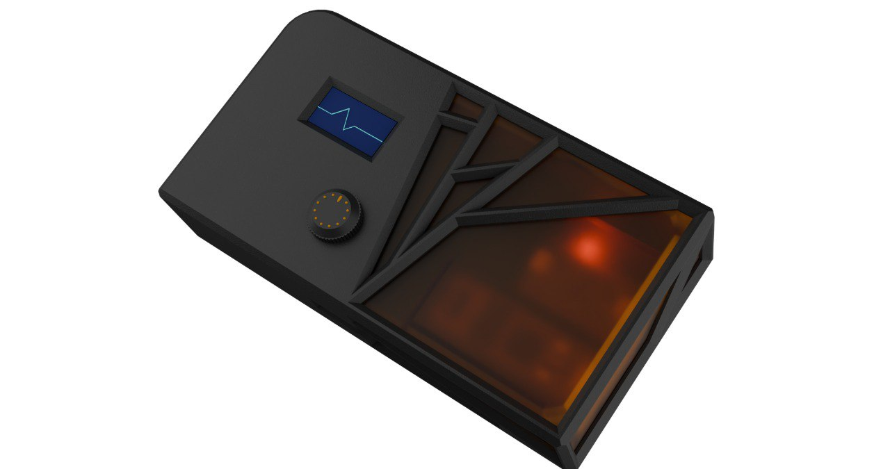

# PSP-Plant Signal Processor


Bare-metal C++ firmware for audio generation based on biorhythms and capacitive variations of plants. The project uses the **Daisy Seed** (STM32H7) development board to acquire data from a capacitive sensor, process it through custom DSP filters, and drive an internal audio synthesis engine, while simultaneously providing visual feedback via an OLED display.

## Complete Project Structure
```text
PSP-PlantSignalProcessing/
├── Hardware/
│   ├── BOM/
│   └── PCB/
│
└── Software/
    ├── libs/
    │   └── PoliTeKDSP/      
    │
    └── src/
        ├── Display/
        │   ├── displayHandler.h
        │   ├── displayHandler.cpp
        │   ├── MenuManager.h
        │   └── MenuManager.cpp
        │
        ├── PSP/
        │   ├── AudioEngine.h
        │   ├── AudioEngine.cpp
        │   ├── PlantConditioner.h
        │   ├── PlantConditioner.cpp
        │
        ├── main.cpp
        ├── Makefile
        └── README.md
```

## Hardware Architecture
* **Microcontroller:** Daisy Seed (ARM Cortex-M7).
* **Capacitive Sensor:** MPR121 communicating via I2C.
* **Display:** I2C OLED Module (e.g., SSD1306/SH1106).
* **User Input:** Rotary encoder with integrated push button.

**Note on I2C connections:** The firmware safely manages the coexistence of the OLED display and the MPR121 sensor on the same physical I2C bus, preventing collisions and hardware lockups (Hard Fault). The I2C bus is configured in Fast Mode at **400 kHz**, the native hardware limit of the MPR121 chip.

## Software Architecture
The project uses the `libDaisy` library for hardware abstraction, and `DaisySP` and `PoliTeKDSP` for audio and sensor processing, structuring the code with a hybrid approach:

* **Event-Driven Data Acquisition:** The reading of capacitive variations is strictly timed via a hardware timer at 200 Hz. This ensures the IIR digital filter calculations receive data at mathematically constant intervals (Δt = 5 ms), bypassing I2C cycle blocks caused by the display.
* **Dynamic Framerate Display Management:** I2C operations towards the OLED are dynamically regulated: 2 Hz in Playmode to leave maximum bandwidth to the DSP, and up to 10 Hz during menu navigation to guarantee UI responsiveness.
* **IIR Digital Filters:** The raw capacitive signal is conditioned through IIR filters (2nd and 4th order Butterworth and Bessel) calculated for the exact sampling frequency of 200 Hz. A median filter (MF) prevents anomalous peaks.
* **State Machine and UI:** The interface manages calibration (sensitivity, hysteresis, curve), musical settings (root, scale, octave), and synthesizer presets. An automatic timeout returns the interface to Playmode after 5 seconds of inactivity.

## Configuration
To clone the repository and correctly download the internal libraries, initialize the submodules:
```bash
git clone --recursive [https://github.com/PoliTeK/PSP-PlantSignalProcessing.git](https://github.com/PoliTeK/PSP-PlantSignalProcessing.git)
cd PSP-PlantSignalProcessing
git submodule update --init --recursive
```

## Build Instructions

### Prerequisites
* **VS Code** installation.
* Follow the [Initial Configuration Guide](https://github.com/electro-smith/DaisyWiki/wiki#1-upload-an-example-program) for VS Code and the Daisy environment.
* Follow the [PlatformIO Guide for MPR121](https://registry.platformio.org/libraries/adafruit/Adafruit%20MPR121/installation) for the capacitive library installation.
* Ensure the DFU USB drivers are installed for the Daisy board (**Warning: this step is often a source of issues and roadblocks**).

### Project Compilation
1. Open the project in VS Code and start the integrated terminal.
2. Navigate to the libraries folder:
   ```bash
   cd Software/libs/PoliTeKDSP/libs
   ```
3. For the first compilation, update the submodules and build the entire project and libraries with:
   ```bash
   cd libdaisy
   make all
   cd ../DaisySP
   make all
   ```
4. Once compilation is complete, move to the src folder:
   ```bash
   cd ../../src
   ```
   connect the Daisy Seed to the PC via USB and put it in DFU mode (using the physical BOOT and RESET buttons). Then execute the upload:
   ```bash
   make 
   make program-dfu
   ```
*Note: The firmware includes a software DFU entry. With the system running normally, simply press and hold the encoder for 4 seconds to force a reboot into bootloader mode.*